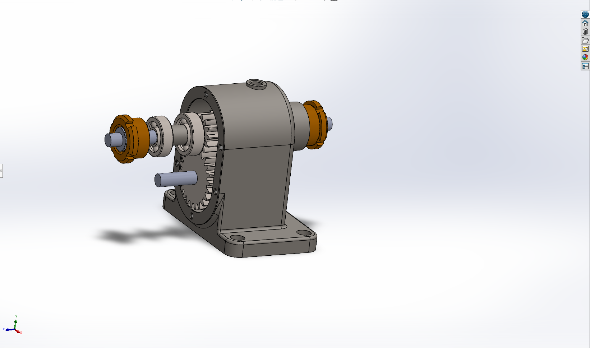
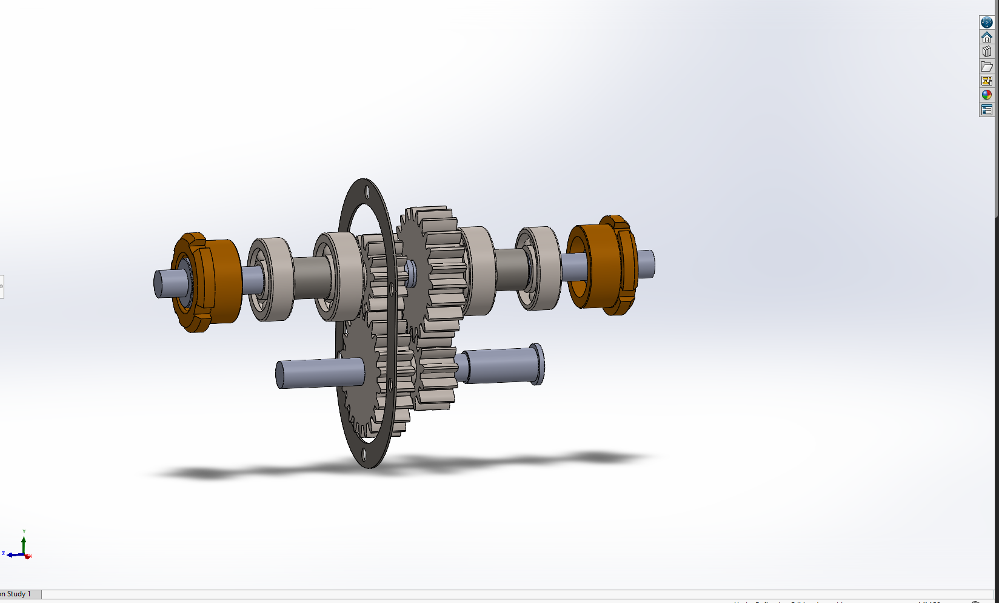

# Single-Stage Spur Gearbox - SolidWorks Assembly


> **Note:** GitHub does not natively render `.SLDASM` or `.SLDPRT` files. Please see the screenshots below or download the repository to view the full assembly in Dassault Systèmes SolidWorks.

 

## 📌 Project Overview
This repository contains the complete 3D CAD model and assembly files for a fully constrained **Single-Stage Spur Gearbox**. Designed entirely in SolidWorks, this project demonstrates a bottom-up assembly approach, precise kinematic gear meshing, and applied Design for Manufacturability (DFM) principles. 

The primary objective of this design is to step down high-speed motor outputs to usable, high-torque rotational speeds without geometric interference.

## ⚙️ Engineering Specifications
Theoretical kinematic calculations were performed prior to CAD modeling to ensure a perfect mechanical fit:

* **Gear Ratio / Reduction:** 2:1
* **Gear Module ($m$):** 2.0 mm
* **Pinion Gear (Driving):** 20 Teeth
* **Main Gear (Driven):** 40 Teeth
* **Shaft Center-to-Center Distance:** 60.0 mm
* **Input / Output Speed:** 1500 RPM -> 750 RPM
* **Theoretical Torque Multiplier:** 2.0x
  


## 🛠️ CAD Methodology & Features
* **Parametric Part Modeling:** Gears modeled using the involute curve method for realistic tooth profiles, preventing binding during rotation.
* **Mechanical Mating:** Utilized SolidWorks **Gear Mates** based on the 2:1 pitch circle ratio to accurately simulate real-world kinematics.
* **Housing Optimization:** Engineered upper and lower casing with uniform wall thickness and strategic ribbing at bearing journals to support radial loads.
* **Interference Validation:** Cleared via SolidWorks Interference Detection to guarantee 100% manufacturability and clash-free rotation.

## 📦 Bill of Materials (BOM)
The assembly (`Assembly1.SLDASM`) consists of 7 constituent parts:
1. `Part1.SLDPRT` - Lower Housing (Base)
2. `Part2.SLDPRT` - Upper Housing (Cover)
3. `Part3.SLDPRT` - Input Shaft
4. `Part4.SLDPRT` - Output Shaft
5. `Part5.SLDPRT` - Pinion Gear (20T)
6. `Part6.SLDPRT` - Main Gear (40T)
7. `Part7.SLDPRT` - Journal Bearings (x4)

## 🚀 How to View the Model
1. Clone this repository to your local machine:
   ```bash
   git clone [https://github.com/yourusername/solidworks-spur-gearbox.git](https://github.com/yourusername/solidworks-spur-gearbox.git)
